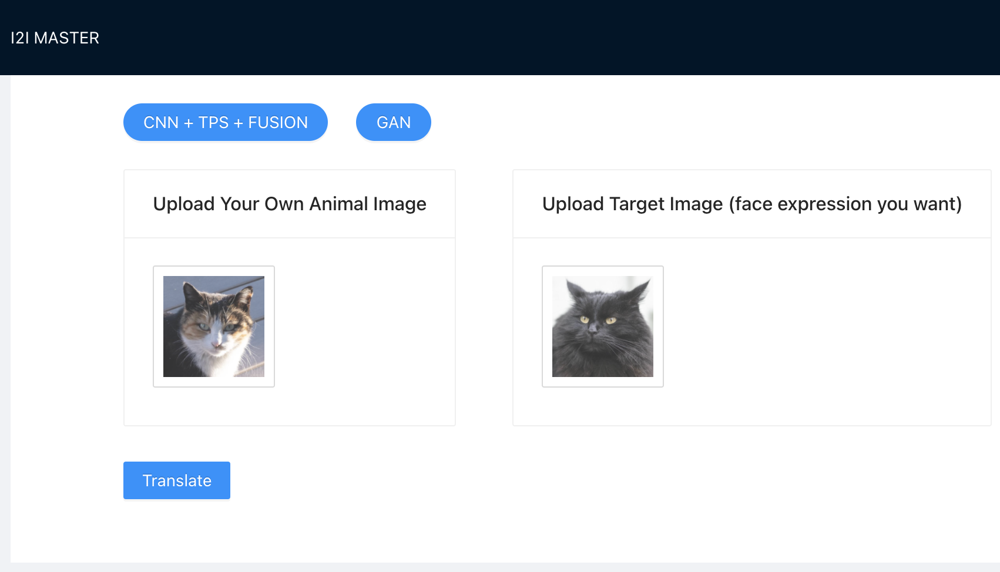
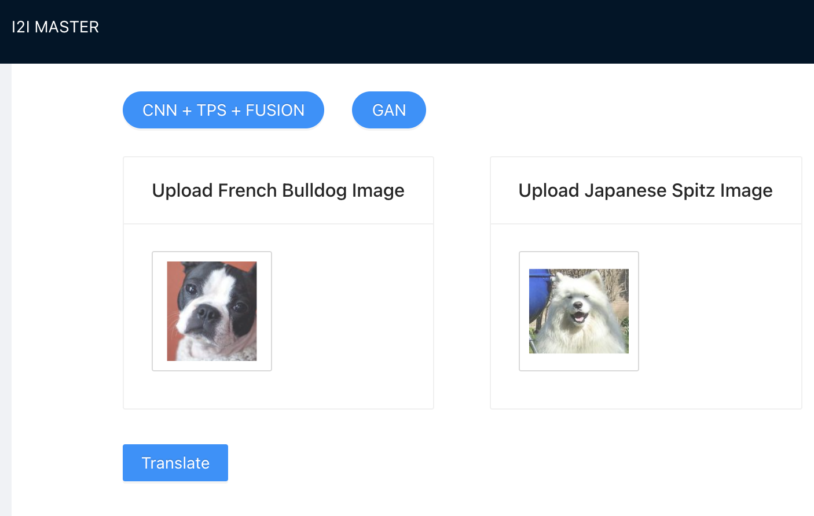

# I2I Master

## About the Project

This project aims to do the face expression exchange between animals.

We have implemented in two ways.

The CNN + TPS + FUSION:
Currently this can only do face expression exchange between cats.


The GAN:
Currently this can only do face expression between Japanese Spitz and French Bulldog.


### Built With

* [React.js](https://reactjs.org/)
* [Flask](https://flask.palletsprojects.com/en/2.0.x/)
* [keras](https://keras.io/)

## Getting Started

### Prerequisites

* Node v16.8.0
* Flask
* tensorflow 2.6.0
* keras-contrib

    ```sh
    pip install git+https://www.github.com/keras-team/keras-contrib.git`
    ```

* PIL
* OpenCV-Python

### Installation

1. Git clone this repo

2. Start backend server \
`cd backend` \
`python3 chatbot.py`

3. Start frontend \
`cd frontend` \
`npm install` (only for first time) \
`npm start`

## Usage

Select the mode first, `CNN+TPS+FUSION` or `GAN`.

Then just drag or click the upload button to upload the image, and then click `Translate`.

## Repo Files Structure

* `backend` folder contains the backend code
* `frontend` folder contains the frontend code
* `images` folder contains some sample images that can upload to the website
* `CNN` folder contains the process of marking the images, trying how TPS works and training the CNN models

## Acknowledgments

This is the project for Pattern Recognition Systems (PRS), which is offered by NUS-ISS.

## Performance


